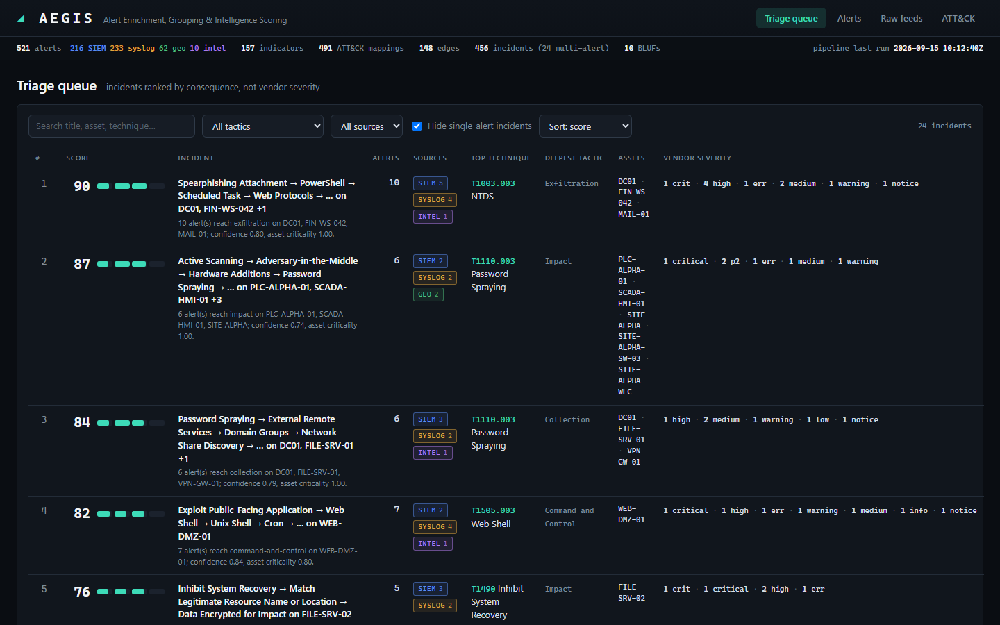

# AEGIS — Alert Enrichment, Grouping & Intelligence Scoring

**IBM Bob AI Innovation Hackathon 2026 — Problem Statement D2: Threat Intelligence Correlation & Alert Prioritisation Assistant**

Turning hundreds of incompatible alerts into a handful of explainable, ranked incidents — and a
commander-ready BLUF that IBM Bob can be interrogated about.



---

## Team — Blue Vector

| Member | Role |
|---|---|
| **Het Khatusuriya** (lead) | Cybersecurity — corpus, IOC extraction, tactic ordering, suppression rules |
| **Manan Modi** | AI/ML — ATT&CK mapping, correlation graph, BLUF generation, evaluation |
| **Mohammad Safik** | Frontend — analyst console, correlation graph view, BLUF panel |
| **Samarth Bhalala** | Backend & Database — ingestion, schema, API, MCP server |

**Track:** AI

## Problem Statement

Defence SOC analysts face thousands of daily alerts across SIEM platforms, network sensors, geospatial
feeds, and written intelligence reports — each in a different format with an incompatible severity
scale. Triage defaults to vendor severity fields that know nothing about the asset involved or about
what else is happening around them. Real multi-stage intrusions fragment into individually unremarkable
alerts across separate consoles, while false positives consume roughly half of all analyst time.

## Solution

AEGIS normalises every source into one schema, maps alerts onto MITRE ATT&CK, and builds a weighted
graph in which incidents emerge as connected components. Every edge carries the evidence that produced
it, so every grouping and every ranking can be explained. IBM Bob is the analyst's conversational
interface into that evidence trail, through an MCP server that reads the same state as the console.

## Key Features (all implemented, all runnable)

- **Four-format ingestion** — SIEM JSON, RFC 5424 syslog, geospatial CSV, and free-text intelligence
  reports normalised into one canonical `Alert`, raw payload preserved for provenance. Defanged
  indicators in prose (`hxxp://`, `185[.]220[.]101[.]4`) are refanged so reports actually correlate.
- **ATT&CK mapping** — every alert matched against the pinned MITRE Enterprise ATT&CK v19.2 corpus
  (697 techniques extracted from the official STIX 2.1 bundle), blending TF-IDF semantic similarity
  with a curated keyword rule table. Optional sentence-transformers backend.
- **Graph correlation with an evidence trail** — four independent signals per alert pair: rarity-weighted
  shared indicators (IDF over the corpus), temporal decay, asset adjacency, and *directional* kill-chain
  tactic progression. Each edge stores every signal's weight and a plain-language rationale.
- **Consequence-based prioritisation** — correlation confidence, asset criticality, kill-chain depth and
  false-positive likelihood from nine documented suppression rules, shown as a decomposition, never a
  single opaque number. Vendor severity is preserved but deliberately excluded from the score.
- **IBM Bob integration** — six read-only MCP tools (`get_priority_queue`, `explain_correlation`,
  `get_bluf`, `why_deprioritised`, `search_by_technique`, `get_incident`) answering from live
  correlation state.
- **BLUF briefs** — fixed commander format with a mandatory GAPS section; deterministic generator with
  optional watsonx.ai Granite refinement that can never invent evidence.
- **Measured, not asserted** — `python -m src.eval.evaluate` scores the pipeline against the corpus
  ground truth. Current results are below.

## Results on the shipped corpus

521 synthetic alerts (216 SIEM, 233 syslog, 62 geo, 10 intel), 8 planted scenarios (6 intrusions,
2 look-alike benign), 466 alerts of realistic noise. Threshold 0.45, one-hour temporal half-life.

| Scenario | Truth | Alerts | Coverage | Purity | Queue position | Suppression rule |
|---|---|---|---|---|---|---|
| Invoice phishing → PowerShell → C2 → DC01 NTDS theft → exfiltration | intrusion | 10 | 1.00 | 1.00 | **1** | – |
| UAS loiter + RF emitter → rogue AP → OT VLAN → PLC write (SITE-ALPHA) | intrusion | 7 | 0.86 | 1.00 | **2** | – |
| VPN password spray → compromised account → AD/share enumeration | intrusion | 6 | 1.00 | 1.00 | **3** | – |
| CVE-2023-22518 → web shell → cron → reverse shell (DMZ) | intrusion | 7 | 1.00 | 1.00 | **4** | – |
| Shadow-copy deletion → masquerading → mass encryption | intrusion | 5 | 1.00 | 1.00 | **5** | – |
| Insider staging → upload to personal cloud (ambiguous) | intrusion | 4 | 1.00 | 1.00 | **6** | – |
| Sysadmin rollout inside change window (looks like persistence + lateral) | benign | 4 | 0.75 | 1.00 | 117 | MAINTENANCE_WINDOW, ADMIN_FROM_ADMIN_WORKSTATION |
| Authorised vulnerability scan, 8 vendor-**CRITICAL** alerts | benign | 12 | 1.00 | 1.00 | 136 | KNOWN_SCANNER_RANGE |

Every intrusion in the top 6 of 456 incidents; both benign scenarios below every intrusion; no noise
alert pulled into any planted incident; 55/55 planted alerts mapped to a technique. 36 of 466 noise
alerts formed small incidents of their own (mostly repeated activity on one host), which is the honest
cost of the threshold. Full numbers: [`src/eval/results.json`](src/eval/results.json).

## Tech Stack

**Language:** Python 3.10+ · **Contracts:** Pydantic · **API:** FastAPI + Uvicorn · **Store:** SQLite
(standard library, no server) · **Graph:** NetworkX · **Mapping:** numpy TF-IDF (optional
sentence-transformers) · **Console:** plain HTML/CSS/JS, no build step, canvas force-directed graph ·
**IBM:** IBM Bob via MCP (Python MCP SDK), watsonx.ai Granite (optional) · **Reference data:** MITRE
ATT&CK Enterprise v19.2 (STIX 2.1)

## How to Run

Python 3.10+ only. No Node, no database server, no model download.

```bash
git clone https://github.com/het-khatusuriya/bob-ai-hackathon-blue-vector.git
cd bob-ai-hackathon-blue-vector
python -m venv .venv && source .venv/bin/activate      # Windows: .venv\Scripts\activate
pip install -r src/requirements.txt
cp src/.env.example .env

python scripts/demo.py        # database → corpus → pipeline → evaluation → console on :8000
```

Open <http://localhost:8000>. API docs at <http://localhost:8000/docs>. Step-by-step commands, the
IBM Bob MCP registration, and a troubleshooting table are in [docs/setup-guide.md](docs/setup-guide.md).

## Demo

- **Video:** see [demo/demo-video-link.txt](demo/demo-video-link.txt)
- **Live demo:** see [demo/live-demo-url.txt](demo/live-demo-url.txt) (runs locally; see setup guide)
- **Screenshots:** [demo/screenshots/](demo/screenshots/)
- **Demo script (what to show, in order):** [docs/demo-script.md](docs/demo-script.md)

## Documentation

- [Problem statement](docs/problem-statement.md)
- [Solution overview](docs/solution-overview.md)
- [Architecture](docs/architecture.md)
- [Setup guide](docs/setup-guide.md)
- [REST API contract](docs/api-contract.md)
- [Project brief and role breakdown](docs/project-brief.md)

## Known Limitations

Stated plainly, because overclaiming is worse than a short honest list.

- **The corpus is synthetic.** Alerts are modelled on real formats and contain deliberately planted
  multi-stage scenarios with ground-truth labels, but no real network telemetry was used. Hashes,
  addresses and hosts are invented.
- **Batch, not streaming.** The pipeline runs over a bounded corpus. There is no live feed ingestion.
- **ATT&CK mapping is keyword-led on short alerts.** The default semantic backend is TF-IDF; semantic-only
  matches are capped at 0.65 confidence and do not chain in correlation. The sentence-transformers
  backend is wired but not the default because it needs a model download.
- **Two planted alerts are missed in the SITE-ALPHA scenario:** a HUMINT report that names the site but
  carries no technical indicator, and one geo track that links only by time and place. The engine is
  told not to chain on timing alone; that is a design choice, and this is its cost.
- **Correlation thresholds are tuned to this corpus.** The sweep is documented in `.env.example`; a
  different alert distribution would need retuning.
- **Suppression knowledge is declared in code**, not pulled from a CMDB or change system.
- **watsonx refinement is untested against a live endpoint** in this submission (no credentials were
  available); the code path validates the model's JSON and rejects hallucinated alert IDs, and the
  template path is what the demo runs on.
- **No threat actor attribution, no automated response, no authentication or multi-tenancy.**

## What We're Most Proud Of

**The evidence trail.** Most AI triage tools produce a ranking and ask you to trust it. AEGIS records why
every edge was drawn and what every score is composed of, then exposes that through IBM Bob in natural
language. Ask `why_deprioritised` about SIEM-0121 — an alert the SIEM marked CRITICAL — and it answers:
position 136 of 456, rule `KNOWN_SCANNER_RANGE`, 12 of 12 alerts from 10.50.1.10 inside the authorised
scanner range on the standing Monday 06:00 schedule, and what evidence would change its mind.

That answer only exists because correlation was built as an evidential graph from the start rather than
as a similarity score with an explanation bolted on afterwards. Start with
[`src/correlation/graph.py`](src/correlation/graph.py) and
[`src/correlation/tactics.py`](src/correlation/tactics.py) if you want to read the strongest work, then
[`src/scoring/suppression.py`](src/scoring/suppression.py) for the domain knowledge that makes
deprioritisation defensible.
