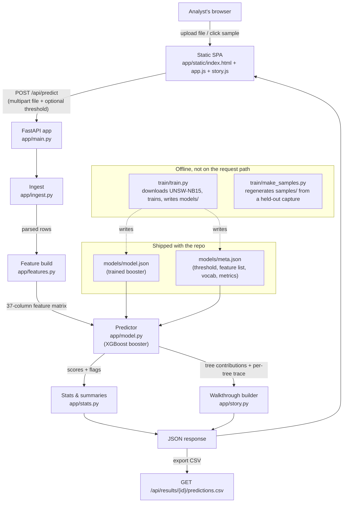

# Architecture

## System diagram

## Components

| Component | Technology | Responsibility |
|---|---|---|
| `app/static/` | HTML/CSS/vanilla JS | Single-page UI: upload, walkthrough animation (`story.js`), full-statistics dashboard (`app.js`). No external JS/CSS libraries — served directly by FastAPI's `StaticFiles`. |
| `app/main.py` | FastAPI | Routes: `POST /api/predict`, `POST /api/predict/sample/{name}`, `GET /api/model`, `GET /api/samples`, `GET /api/results/{id}/predictions.csv`, `GET /api/health`. Validates file size (300 MB cap) and column coverage (≥40%) before scoring. |
| `app/ingest.py` | pandas, pyarrow | Reads CSV/Parquet/JSON/NDJSON, including headerless UNSW-NB15 CSVs; normalises column names/aliases; parses `label`/`attack_cat` ground truth when present. |
| `app/features.py` | pandas, NumPy | Column schema (37 numeric + categorical flow features), aliases, one-hot encoding for `proto`/`service`/`state` against the training vocabulary. |
| `app/model.py` | XGBoost | Loads `models/model.json` + `meta.json`, builds the feature matrix, scores rows, and produces per-row explanations from XGBoost's exact tree-contribution values. |
| `app/stats.py` | scikit-learn | Precision/recall/F1/ROC-AUC/PR-AUC, confusion matrix, per-attack-category detection rate, traffic summaries (protocol/service/source/port/time breakdowns). |
| `app/story.py` | XGBoost, NumPy | Builds the 7-step walkthrough payload: the running log-odds after each tree for the top- and lowest-scoring events, and the explained contributions for the top event. |
| `models/` | — | The trained booster and its metadata — committed to the repo so the app runs with zero setup. |
| `train/` | XGBoost, HF datasets | `train.py` downloads UNSW-NB15, trains and evaluates the model, writes `models/`; `make_samples.py` regenerates `samples/` from a held-out capture. Not on the request path — offline, run manually to retrain. |
| `tests/` | pytest, FastAPI TestClient | Ingest/feature/API-level tests. |

## End-to-end data flow

1. Browser uploads a file (or requests a bundled sample) to `POST /api/predict`.
2. `ingest.py` parses it into a DataFrame and reports which of the model's expected columns
   were found, renamed, or are missing.
3. `features.py` builds the 37-feature matrix the model was trained on, using the same
   category vocabulary (`proto`/`service`/`state`) captured at training time.
4. `model.py` scores every row with the pre-trained XGBoost booster and computes per-row
   explanations for the top-N rows via tree contributions.
5. `stats.py` builds the summary statistics (and, if labels are present, the full metrics
   suite) and `story.py` builds the walkthrough payload from the single highest- and
   lowest-scoring events.
6. Everything is returned as one JSON response; the UI renders the walkthrough first, then the
   full-statistics dashboard on request. The scored rows are also written to a temp CSV,
   downloadable via `/api/results/{id}/predictions.csv` (the last 5 results are kept in memory).

## Where IBM Bob would plug in (not yet built)

The natural integration point is `app/model.py`'s `Predictor.score`/`Predictor.explain` and
`app/stats.py`'s metrics functions, wrapped as MCP tools (`score_flows`, `explain_event`,
`detection_metrics`). An analyst could then ask Bob "why was row 482 flagged?" or "how would
raising the threshold to 0.8 change my false-positive rate on this file?" and get an answer
computed from the real model instead of a canned response. This is scoped as future work — see
[`README.md`](../README.md#known-limitations).

## Security & scalability notes

- No credentials, accounts or external network calls are on the request path — the model is
  loaded from local disk, and the app has no database. There is nothing here that stores or
  transmits secrets.
- Uploaded files are capped at 300 MB (`MAX_BYTES` in `app/main.py`) and processed in memory;
  larger files or higher concurrency would need chunked/streaming ingestion.
- Prediction exports are kept in a temp directory, capped at the 5 most recent results, and are
  not persisted beyond the process lifetime.
- The app is single-process and stateless aside from that small in-memory export cache, so it
  scales horizontally behind a load balancer with no shared state to coordinate.
