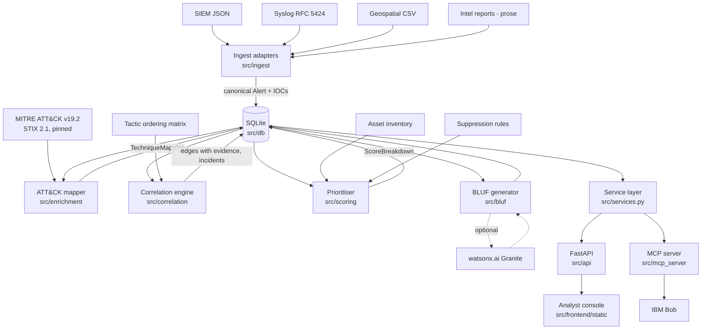

# Architecture

## System diagram

The one structural decision worth noticing: **the API and the MCP server share one service layer over
one SQLite file.** IBM Bob and the console cannot disagree, because neither computes anything - they
both read what the pipeline persisted.

## Components

| Component | Technology | Responsibility |
|---|---|---|
| Ingest adapters | Python, Pydantic | Parse four wire formats into the canonical `Alert`; refang and extract indicators; resolve assets; preserve raw payload |
| Alert store | SQLite (stdlib `sqlite3`) | Persist alerts (JSON document + indexed columns), indicators, mappings, edges, incidents, scores, briefs, pipeline runs |
| IOC extractor | Python regex + validators | IPv4/6, domains (TLD allowlist), URLs, hashes, e-mail, CVE, MAC, user principals, hostnames - from fields and free prose |
| ATT&CK mapper | numpy TF-IDF (optional sentence-transformers), MITRE CTI | Rank technique candidates per alert; blend semantic similarity with a curated keyword rule table; calibrated confidence |
| Correlation engine | NetworkX | Four weighted signals per candidate pair; connected components above threshold; size cap; every edge stores its evidence |
| Tactic ordering matrix | Python | Curated plausible/implausible kill-chain transitions plus a forward-distance model; directional |
| Prioritiser | Python | Four-factor score (confidence, asset, tactic depth, FP likelihood) with per-factor explanations |
| Suppression rules | Python | Nine documented rules with strength and evidence; declared enclave knowledge (scanner ranges, change windows, admin VLAN, service-account scope) |
| BLUF generator | Python template, optional watsonx.ai | Fixed commander format with mandatory GAPS; model may only rewrite narrative fields and is validated against the evidence |
| Service layer | Python | Every query the console or Bob can make, returning the shapes in `docs/api-contract.md` |
| REST API | FastAPI + Uvicorn | Thin wrapper over the service layer; serves the console |
| MCP server | Python MCP SDK, stdio | Six read-only tools for IBM Bob; prose rendering plus JSON |
| Analyst console | HTML/CSS/JS, canvas | Queue, incident detail with force-directed correlation graph and evidence hover, kill-chain strip, score decomposition, BLUF, why-deprioritised, raw feeds, ATT&CK search |
| Evaluation harness | Python | Coverage, purity, queue position, suppression success against `ground_truth.json` |

## Data flow

1. Feeds live in `src/corpus/feeds/` in four native formats (generated deterministically by
   `src/corpus/generate.py` from `scenarios.py` + `noise.py`; committed so a judge never regenerates).
2. `src.corpus.load` runs the matching adapter per file. Each produces canonical `Alert` records:
   `alert_id`, `source`, `timestamp`, `raw_text`, `source_severity` (verbatim, never normalised),
   `asset` (joined to the inventory, criticality left empty), `indicators`, `raw_payload`.
   An alert's own host and user are removed from its indicators so asset adjacency and shared
   indicator remain independent signals.
3. `src.pipeline.run` maps every alert to ATT&CK (top-3 candidates ≥ 0.35), then correlates:
   - candidate pairs = within 24 h **or** sharing an indicator (never miss a shared hash);
   - Signal 1 shared indicator (≤ 0.40): IDF rarity × type factor (hash 1.0 … hostname 0.6; private
     IPs 0.6; allowlisted infrastructure ×0.15), diminishing returns for multiple shared;
   - Signal 2 temporal (≤ 0.20): `0.5^(Δt / half-life)`; intel reports use a 7-day half-life because a
     report is a standing assessment, not a point event;
   - Signal 3 asset adjacency (≤ 0.15): same asset 1.0 (0.75 if different principals), same user 0.8,
     one alert naming the other's asset 0.7, same subnet 0.6;
   - Signal 4 tactic progression (≤ 0.25): best over the top-2 mappings each side of
     `progression_score(first, second) × min(confidence)`; only mappings ≥ 0.55 chain; halved when the
     pair shares no entity or indicator (ordering alone is coincidence).
   Edges ≥ 0.45 are kept; incidents are connected components; components over 40 alerts shed their
   weakest edges.
4. Each incident is scored: `100 × (0.35·confidence + 0.30·asset + 0.25·tactic + 0.10·breadth) × (1 − fp)`.
   Every factor keeps a sentence of explanation. Suppression rules return evidence, not booleans.
5. The top-N incidents get a BLUF. The template is built from persisted state; if watsonx is configured
   its JSON is validated (no unknown alert IDs, all sections present) before replacing narrative fields.
6. The API and MCP server serve all of it from the same file. `explain_correlation` on two alerts that
   were *not* linked scores the pair on the fly and reports why it fell short of the threshold.

## Canonical contracts

`src/models.py` is the frozen contract (see the file for full field documentation): `Alert`,
`Indicator`, `AssetRef`, `TechniqueMapping`, `SignalContribution`, `CorrelationEdge`, `ScoreBreakdown`,
`Incident`, `BlufReport`. Two load-bearing details: `Tactic` is declared in kill-chain order and
Signal 4 reads that order; `Indicator.value` is case-folded so the same hash from two feeds matches.

## Database schema

`alerts`, `alert_indicators`, `attack_mappings`, `correlation_edges`, `incidents`, `incident_alerts`,
`assets`, `bluf_reports`, `pipeline_runs`. Indexes on `alerts(timestamp)`, `alerts(asset_id)`,
`alert_indicators(indicator_value)`, `attack_mappings(technique_id)`, `incidents(composite_score)`.
Canonical records are stored as JSON documents next to the indexed columns, so the Pydantic model
remains the single source of truth for shape.

## Security notes

- No real credentials in the repository; `.env` is gitignored and `.env.example` carries placeholders.
- The corpus is entirely synthetic: documentation address space, invented hashes, fictional hosts.
- Raw payloads are stored verbatim to preserve chain of evidence; in production that store needs
  encryption at rest and access control, since raw alerts contain infrastructure detail.
- The MCP server is read-only by construction: it has no tool that writes, and the service layer it calls
  has no mutating entry points reachable from Bob.
- The console escapes all injected text; alert content is attacker-influenced by definition.

## Scalability notes

The demo runs a 521-alert corpus in about three seconds in-process. The design scales along three axes:
candidate-pair generation is bounded by the time window plus an indicator index rather than O(n²);
technique vectors are computed once per corpus version; and the pipeline stages communicate only
through the store, so ingestion, enrichment and correlation could become queue-driven workers without
touching the data model. None of that is implemented, and the known-limitations list says so.
