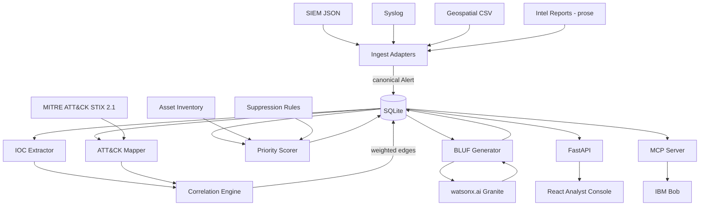

# Architecture

## System diagram



## Components

| Component | Technology | Responsibility |
|---|---|---|
| Ingest adapters | Python, Pydantic | Parse four wire formats into the canonical `Alert` schema; preserve raw payload |
| Alert store | SQLite (via SQLAlchemy) | Persist alerts, incidents, edges, mappings, scores, briefs |
| IOC extractor | Python, regex + validators | Extract indicators from structured fields and free prose |
| ATT&CK mapper | sentence-transformers, MITRE CTI | Rank technique candidates per alert with confidence |
| Correlation engine | NetworkX | Build weighted alert graph; extract incidents as connected components |
| Priority scorer | Python | Four-factor incident scoring with visible decomposition |
| BLUF generator | watsonx.ai Granite, template fallback | Produce structured commander briefs |
| MCP server | Python MCP SDK | Expose correlation and scoring to IBM Bob as callable tools |
| REST API | FastAPI | Serve the analyst console |
| Analyst console | React, Vite | Queue, incident detail, graph view, ATT&CK view, BLUF panel |

## Data flow

1. Raw alerts land in `data/feeds/` in four native formats.
2. The matching adapter parses each into a canonical `Alert` — `alert_id`, `source`, `timestamp`,
   `raw_text`, `asset`, `indicators`, `source_severity`, `raw_payload`.
3. Alerts are persisted. `raw_payload` is retained so any downstream claim can be traced to the
   original record.
4. The IOC extractor populates the indicator table and computes corpus-wide indicator frequencies.
5. The ATT&CK mapper embeds alert text and matches it against pre-embedded technique descriptions,
   writing ranked `(technique_id, tactic, score)` rows.
6. The correlation engine evaluates candidate alert pairs — bounded by a coarse time and asset
   pre-filter to avoid O(n²) across the full corpus — computing four signal weights per pair and
   writing edges above threshold.
7. Connected components above the incident threshold become incidents.
8. The scorer computes the four factors per incident and persists both the composite score and the
   decomposition.
9. The BLUF generator renders the top incidents, falling back to the deterministic template if
   watsonx is unavailable.
10. The API and MCP server read from the same persisted state, so Bob and the UI never disagree.

## Canonical Alert schema

```python
class Alert(BaseModel):
    alert_id: str
    source: Literal["siem", "syslog", "geo", "intel"]
    timestamp: datetime
    raw_text: str
    source_severity: str | None
    asset: AssetRef | None
    indicators: list[Indicator]
    raw_payload: dict
```

This contract is frozen early in the build. Every other component depends on it.

## Database schema

`alerts`, `indicators`, `alert_indicators`, `attack_mappings`, `correlation_edges`, `incidents`,
`incident_alerts`, `assets`, `suppression_rules`, `bluf_reports`.

Indexes on `alerts(timestamp)`, `alerts(asset_id)`, and `alert_indicators(indicator_value)` — the
correlation pre-filter depends on all three.

## Security notes

- No real credentials in the repository; `.env` is gitignored and `.env.example` carries dummy values.
- The corpus is entirely synthetic. No real network telemetry, no real asset names.
- Raw payloads are stored verbatim to preserve chain of evidence — in a production deployment this
  store would require encryption at rest and strict access control, since raw alerts frequently
  contain sensitive infrastructure detail.
- The MCP server is read-only. It exposes no tool capable of mutating state or taking action on an
  asset, which is deliberate: automated response on the basis of a probabilistic assessment is not
  something we would recommend in this domain.

## Scalability notes

The demo runs a bounded corpus in-process. The design scales along three axes: the pairwise correlation
pre-filter keeps edge computation tractable as alert volume grows; technique embeddings are computed
once and cached; and the pipeline stages are independently schedulable, so ingestion, enrichment, and
correlation could be separated into queue-driven workers without changing the data model. None of that
is implemented for the hackathon and it is listed accordingly under known limitations.
